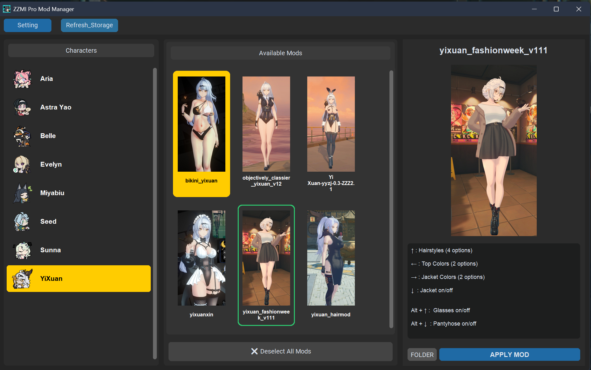
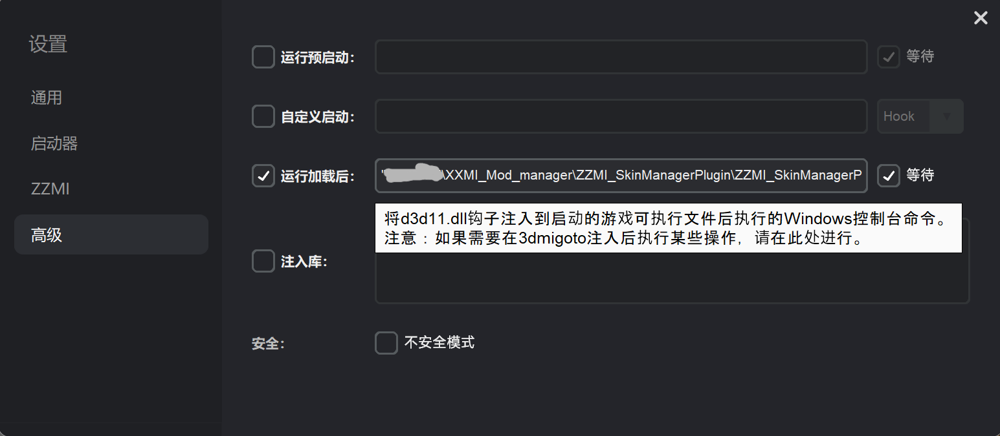

# ZZMI_SkinManagerPlugin 

可与 [XXMI (ZZMI)](https://github.com/SpectrumQT/XXMI-Launcher) 相互配合，解决多 Mod 冲突及频繁手动移动文件的问题。你可以在游戏运行过程中，通过快捷键随时唤醒管理界面进行皮肤的更换，无需重启游戏或手动操作目录。



---

## 原理
本插件通过管理（选择性生成，删除）`ZZMI` 扫描的 `Mods` 文件夹下的 “目录交汇点”（类似于快捷方式）。从而实现让`ZZMI`仅加载选定Mod的功能。
1. Mods_Storage: 这个是在我们的插件目录下的一个文件夹，你下载的所有Mod都应该按照一定格式存储在这里。
2. Mods: 这个是ZZMI目录下面的一个文件夹，ZZMI会扫描其中所有的Mod，并全部加载到游戏中。为了避免冲突，请不要在该文件夹防止任何Mod, 仅让插件管理。

---

## 快速开始

### 1. 环境准备
1.  **下载 XXMI**：确保已安装 [XXMI Launcher](https://github.com/SpectrumQT/XXMI-Launcher) 并在其界面内下载安装好 **ZZMI**。
2.  **安装插件**：下载本插件压缩包，解压至 XXMI 根目录。
3.  **联动配置**：打开 XXMI 设置界面，切换到 **“高级 (Advanced)”** 选项卡：
    *   勾选 **“运行加载后 (Run Post-load)”**。
    *   在输入框中填入插件 `.exe` 的**绝对路径** （如果路径中存在空格，则必须用双引号包裹）。



### 2. Mod 整理规范
为了让插件正确识别，请将下载的 Mod 按以下结构存放于 `Mod_Storage` 目录下：（两种可选的png图片是需要你自行准备的）

```text
\Mod_Storage
  └── \角色名 (例如: Anby)
        ├── character.png          [可选] 角色头像
        ├── \皮肤A (解压后的Mod文件夹)
        │     ├── cover.png        [可选] 皮肤预览图 (建议宽高比 1:2)， 你需要在解压后的Mod文件夹下主动放置该图片。
        │     ├── desc.json        [插件自动生成] 你无须主动创建
        │     └── ... (其他Mod文件, 你无须修改。有嵌套也无所谓，ZZMI会自动扫描文件。)
        └── \皮肤B
              └── ...
```
*   **创建角色文件夹**：你需要在 `Mod_Storage` 目录下创建一个文件夹，用于存放该角色的所有 Mod。
*   **角色头像**：在角色文件夹下放置 `character.png`，插件左侧栏将显示该头像。
*   **皮肤Mod**：你需要将你下载的皮肤Mod压缩包，解压到对应角色文件夹中。（解压后的所有文件应该只存在角色文件夹下的一个文件夹中）
*   **皮肤预览**：在具体 Mod 文件夹下放置 `cover.png`，插件右侧详情栏将展示该预览图。

### 3. 使用说明
1.  **呼出界面**：通过 XXMI 启动游戏，进入游戏后按下 **`F7`**（默认热键）唤醒插件。
2.  **切换皮肤**：
    *   **单击**中栏 Mod：在右侧栏查看预览图及详细描述。
    *   **双击**中栏 Mod：立即应用该皮肤并向游戏发送 `F10` 刷新信号。
    *   **应用按钮**：点击右侧栏下方的 `APPLY MOD` 达到相同效果。
3.  **取消选中**：点击中栏下方的 `Deselect` 按钮，将移除该角色的所有 Mod 链接，恢复游戏原生模型。
4.  **备注与称谓修改**：
    *   双击右侧栏的**标题**或**描述文字区**进入编辑模式。
    *   编辑完成后，**双击窗口内任意空白区域**即可自动保存。你可以利用此功能记录 Mod 的局内快捷键（你下载皮肤Mod时，通常会介绍该皮肤的Toggles按键,你可以记录在这儿）。

---

## 其余功能

### 1. 刷新仓库 (Refresh)
如果你在游戏运行期间向 `Mod_Storage` 放入了新下载的 Mod，点击插件左上角的 **`Refresh_Storage`** 按钮，插件将重新扫描目录并更新列表。

### 2. 进程联动与隐藏
*   **自动生命周期**：插件会随游戏的启动而启动，随游戏的结束而彻底关闭，无需手动干预后台。
*   **静默运行**：点击插件右上角的 `X` 不会结束程序，而是将其隐藏至后台，随时可通过热键再次呼出。

### 3. 自定义设置 (Setting)
点击左上角 **`Setting`** 按钮可进入配置页面：
*   **路径重定向**：若插件未放置在 XXMI 目录下，请在此处手动指定 ZZMI 的 `Mods` 文件夹路径。
*   **热键修改**：支持自定义呼出热键。点击录入按钮后按下目标按键即可（支持 `Ctrl/Alt/Shift` 组合键）。

---

## 注意事项
1.  **渲染刷新提示**：应用 Mod 时，建议不要让对应角色处于当前画面中（例如正在操控该角色）。若出现贴图错误，请先切换至其他角色，按 `F10` 刷新后再切回（如果还有错误，建议查看你下载皮肤mod的页面的评论区，有些久远mod在现在的游戏版本中会有一些问题，评论区的大佬们通常会给出解决方案）。
2.  **管理员权限**：为确保“交汇点文件”创建成功及 `F10` 信号能穿透游戏窗口，建议**以管理员身份运行 XXMI**（插件将继承权限）。（你双击运行XXMI Launcher时，便会弹窗提示你是否允许该程序修改你的电脑。你只有点允许了，XXMI才会正常运行。所以正常情况下你无须关注这点）
